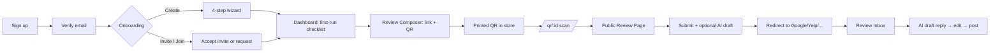

# Flonion: UI/UX Design System & Implementation Plan

> **Assumptions**
> - **Brand attributes (chosen by me, as requested):** *Trustworthy, Approachable, Sharp, Local-first.* Reviews are about reputation, so trust leads. Owners are often non-technical, so the product must feel approachable. "Sharp" keeps it from looking like a toy. "Local-first" reflects the QR-in-store and Google Business Profile focus.
> - **Audience interpretation:** "Business owners" is read as **owners and managers of small-to-mid local businesses** (restaurants, clinics, salons, agencies, shops), several of them India-based given JustDial support and the ZeptoMail/DeepSeek stack. They use Flonion a few times a week rather than all day, often on a phone. A second audience is **their customers**, who land on the public review and booking pages once, usually on a phone right after scanning a QR code. The design must serve both.
> - **Stack:** taken from the README: SolidStart 2 (Solid v1) + Vite 8, Tailwind CSS v4, Ark UI (Solid), Tabler icons, Jost + Rubik fonts. Every recommendation below is Solid-native; no React packages.
> - **Page inventory:** derived from the README's `routes/` tree and API tables. Pages not explicitly named there (404, 500) are marked *(inferred)*.
> - **Operator console (`app/`, React Router):** out of scope. It is an internal tool with a different audience; it can reuse the tokens from Section 2.

**Inputs**
- **Concept:** AI-powered review collection, reply drafting, and local SEO workspace with QR capture, bookings, marketplace, and team tasks.
- **Audience:** local business owners and their teams, plus their customers on public pages.
- **Platform/Stack:** responsive web app on SolidStart 2 + Tailwind v4 + Ark UI (Solid).
- **Brand:** Trustworthy · Approachable · Sharp · Local-first.

---

## 1. Strategic Design Direction & Trend Fit

**Primary paradigm: Soft / Organic-leaning Minimalist.** Minimalist Data-Dense leads inside the app, with a soft, warm layer on public and first-run surfaces.

| Surface | Paradigm | Why |
|---|---|---|
| App (dashboard, inbox, SEO, tasks) | **Minimalist, medium density** | Owners scan ratings, counts, and to-dos. They need fast reading, not decoration. "Medium" rather than "dense" because they are not analysts. |
| Public review & booking pages | **Soft / Organic** | A customer in a shop is asked for a favour. Warm, rounded, low-effort UI raises completion. Every extra tap costs a review. |
| Landing & pricing | **Bento grid** accents inside the soft system | Flonion has many unrelated modules (reviews, SEO, bookings, marketplace, tasks); bento tiles show breadth without a wall of text. |

**Justification.** The core job is *"turn happy customers into public reviews, and respond to all reviews quickly."* Success depends on two moments: a customer completing a review in under a minute on a phone, and an owner clearing the inbox in a few minutes. Both reward clarity and warmth over spectacle. Trust matters because the product touches public reputation and uses AI to write text. The UI must make it obvious what the AI wrote and what the human approved.

**Anti-patterns specific to Flonion**

1. **Making AI text look final.** If AI-suggested reviews or replies render like already-posted content, owners may publish unreviewed text, and customers may feel they are submitting words that are not theirs. Always label AI drafts ("AI draft · edit before posting") and keep them in an editable field. This protects trust and reduces platform-policy risk around review authenticity.
2. **Gamified star animations on the public review page.** Bouncing or confetti-heavy star pickers feel like manipulation on a page whose purpose is honest feedback. They also slow the one interaction that matters. Use a calm, instant selection state.
3. **Colour-only sentiment and status.** Green/red sentiment chips, booked/free slots, and task priority all fail for colour-blind users (WCAG 1.4.1). Always pair colour with an icon and a text label.
4. **Blank analytics on day one.** A new business has zero scans and zero reviews. Empty charts read as "broken." Use guided empty states with the single next action (print your QR, share your link).
5. **Desktop-only kanban and scheduler.** Owners check tasks and meetings on phones. Drag-only interactions with no tap alternative lock out mobile and keyboard users.

---

## 2. Visual Language & Ergonomics

### Colour

The palette is violet-led ("onion") with a teal secondary and warm neutrals. It supports **light and dark mode**; light is the default because public pages are often opened in bright shops.

All ratios below were computed with the WCAG 2.x contrast script, not estimated.

| Role | Light hex | Dark hex | Usage | Verified contrast (light · dark) |
|---|---|---|---|---|
| **Primary** | `#5B21B6` | `#A78BFA` | Primary buttons, links, active nav, focus ring | On canvas: 8.47:1 AAA · 6.82:1 AA. Button label: white on primary 8.98:1 AAA · `#14121A` on primary 6.82:1 AA |
| **Secondary** | `#0F766E` | `#2DD4BF` | Secondary actions, QR/marketing highlights, "connected" states | On canvas: 5.16:1 AA · 9.97:1 AAA. White on `#0F766E`: 5.47:1 AA |
| **Background / Canvas** | `#FAF8F5` | `#14121A` | Page background (warm off-white / off-black, avoids halation) | Body text `#1C1917` 16.50:1 · `#EDEAF2` 15.61:1 (AAA) |
| **Surface / Card** | `#FFFFFF` | `#1E1B26` | Cards, drawers, table rows, modals | Body text 17.49:1 · 14.24:1 (AAA). Muted text `#57534E` 7.63:1 · `#A8A3B3` 6.90:1 |
| **Semantic / Accent: Star** | `#C2680A` (fill) · `#B45309` (text) | `#FBBF24` | Star ratings, rating numbers | Star fill as a UI graphic: 3.75:1 on canvas, 3.98:1 on white (AA non-text) · 10.15:1 on dark surface. Text `#B45309`: 4.74:1 AA |

**Supporting tokens (also verified)**

| Token | Light | Dark | Contrast |
|---|---|---|---|
| Text muted | `#57534E` | `#A8A3B3` | 7.20:1 AAA · 7.56:1 AAA on canvas |
| Success | `#15803D` | `#4ADE80` | 4.73:1 AA · 10.65:1 AAA on canvas |
| Warning | `#B45309` | `#FBBF24` | 4.74:1 AA · 11.12:1 AAA on canvas |
| Error | `#B91C1C` | `#F87171` | 6.10:1 AA · 6.71:1 AA on canvas |
| Input / control border | `#8A847E` | `#6E6880` | 3.49:1 · 3.50:1 on canvas (meets 3:1 non-text, WCAG 1.4.11) |
| Divider (decorative only) | `#E7E5E4` | `#2A2633` | Not a control boundary, so 3:1 is not required |

**Rejected values, for the record:** the common amber `#F59E0B` measured only 2.15:1 on white and cannot be used for star icons. Stone-400 `#A8A29E` measured 2.38:1 and cannot be used for input borders.

**Semantic rules**
- Sentiment chip = icon + word + colour: 😊-style smile icon "Positive" (success), meh icon "Mixed" (warning), frown icon "Negative" (error). Use Lucide `smile`, `meh`, `frown`.
- Ratings always show the number next to the stars ("4.6 ★").
- Slot states: "Free" (outline), "Booked" (filled + lock icon), "Past" (muted + strikethrough label).

### Typography

Flonion already ships **Jost** and **Rubik**. Keep them. Both are on Google Fonts under the SIL Open Font License, so there is no licensing cost.

| Role | Font | Notes |
|---|---|---|
| Display / Headings | **Jost** 500–600 | Geometric, friendly, sharp at large sizes. Use for H1–H3 and KPI numbers. |
| Body / UI | **Rubik** 400–500 | Slightly rounded; readable at 14–16px on phones. |
| Monospace (data, IDs, tokens, URLs) | **JetBrains Mono** 400 (Google Fonts, OFL) | For review links, invite tokens, error reference IDs. |

**Numbers:** apply `font-variant-numeric: tabular-nums` (Tailwind `tabular-nums`) to KPI strips, tables, and analytics. **Unverified:** I could not confirm that Jost and Rubik include the `tnum` OpenType feature. Test it in the browser; if columns don't align, use JetBrains Mono for table numerals only.

**Scale: 1.25 (Major Third), base 16px**

| Step | rem / px | Line-height | Use |
|---|---|---|---|
| xs | 0.8rem / 12.8px | 1.5 | Captions, chip labels (min; never smaller) |
| sm | 0.875rem / 14px | 1.5 | Table cells, helper text *(practical step between xs and base)* |
| base | 1rem / 16px | 1.6 | Body, inputs (16px prevents iOS zoom on focus) |
| lg | 1.25rem / 20px | 1.45 | Card titles |
| xl | 1.563rem / 25px | 1.35 | H3, section titles |
| 2xl | 1.953rem / 31.25px | 1.25 | H2, KPI values |
| 3xl | 2.441rem / 39px | 1.15 | H1 (app) |
| 4xl | 3.052rem / 48.8px | 1.1 | Landing hero (clamp down to 2.441rem on mobile) |

### Layout

- **Spacing:** 4px base. Tokens: 4, 8, 12, 16, 24, 32, 48, 64.
- **Radius:** 8px controls, 12px cards, 20px public-page cards and sheets (the "soft" layer), full for chips and avatars.
- **Grid:** 12 columns, 24px gutters (16px on mobile), max container 1280px for the app and 1120px for marketing. Public review page: single column, max 480px.
- **Breakpoints** (Tailwind v4 defaults): `sm` 640 · `md` 768 · `lg` 1024 · `xl` 1280.
- **App shell:** left sidebar 256px (collapsible to 72px icon rail at `lg`), becomes a bottom tab bar (5 items: Dashboard, Reviews, Marketing, Collaborate, More) below `md`.
- **Density per surface**

| Surface | Row height | Card padding |
|---|---|---|
| App tables (inbox, members, tasks) | 48px | 16px |
| App cards / KPIs | — | 20px |
| Public review / booking | 56px controls | 24px |
| Landing | — | 32px+ |

- **Touch targets:** at least 44×44 CSS px for all tappable elements (star buttons, slot chips, tone tabs). WCAG 2.2 AA's floor is 24×24, but public pages are used one-handed in shops.
- **Focus:** 2px `Primary` outline with 2px offset on every interactive element; never remove it.

---

## 3. Motion & Immersion Strategy (Necessity Analysis)

| Tier | Verdict | One-line reason |
|---|---|---|
| 1. Micro-interactions & transitions | **YES** | Masks AI latency, confirms saves, and orients drawer/sheet changes at almost no cost. |
| 2. Interactive vector (Lottie / Rive) | **SELECTIVE** (dotLottie only; no Rive) | A few one-shot moments (review submitted, empty states) benefit; nothing needs a state machine. |
| 3. High-fidelity 3D (WebGL / Three.js / Spline) | **NO** | Not additive to any core task. |

**Tier 1: YES.** The DeepSeek calls (suggest-review, draft-reply) take noticeable time. Staged skeletons and a gentle reveal make waiting feel intentional. Drawers, toasts, and kanban reordering need motion to show where things went. Cost is small if limited to `transform`/`opacity`.

**Tier 2: SELECTIVE.** Use short dotLottie clips in exactly three places: the "Thanks for your review" confirmation on the public page, the first-run dashboard empty state, and the onboarding completion step. They add warmth where the Soft/Organic layer lives. Costs: the dotLottie player uses WebAssembly and a canvas, which adds download size and some CPU on low-end phones. Lazy-load it after the page is interactive, and never place it on the LCP path. Rive is rejected: none of these moments need interactive state machines, so a second runtime is not justified.

**Tier 3: NO.** There is no spatial object for a business owner to inspect. A 3D hero on the landing page would cost bundle size, GPU and battery, and likely Largest Contentful Paint on the page that has to convert. A 3D QR or globe on the dashboard would compete with numbers. Revisit only if a genuinely spatial feature appears (for example, a table-stand QR mockup configurator), and user-test it first.

---

## 4. Animation & Interaction Blueprint

Tier 3 is marked NO, so it has no elements here.

| Element | Trigger & behaviour | Cognitive purpose | Reduced motion |
|---|---|---|---|
| **AI Draft Reveal** (tier 1) | **Entry:** while waiting, 3 skeleton cards with a 1.6s shimmer loop. On response, cards fade in and rise 8px, 220ms `cubic-bezier(0.2, 0, 0, 1)`, staggered 60ms. **Hover/focus:** border to Primary, 120ms. **Select:** chosen card scales 1 → 1.01 → 1 over 160ms; others dim to 60% opacity. | Masks LLM latency; the stagger invites comparing the three tones one by one. | No shimmer (static skeleton with "Writing drafts…" text); cards appear instantly; selection = border change only. |
| **Star Rating Select** (tier 1) | **Hover/focus:** stars up to the pointer fill, 80ms ease-out. **Select:** fill locks; the numeric label updates. No bounce. | Immediate, calm confirmation of the one required input. | Same, with 0ms transitions (it is already minimal). |
| **Sheet / Drawer** (tier 1) | Review detail drawer (desktop, from right) and bottom sheet (mobile). **Entry:** translate 100% → 0, 240ms `cubic-bezier(0.2, 0, 0, 1)`; backdrop opacity 0 → 0.4, 200ms. **Exit:** 180ms ease-in. Driven by Ark UI `data-state` + `tw-animate-css`. | Keeps the list visible as the "place" the user came from. | Opacity-only fade, 120ms. |
| **Toast & Save Confirmation** (tier 1) | **Entry:** slide up 12px + fade, 200ms. **Idle:** 5s, paused on hover/focus. **Exit:** fade, 150ms. Announced via `aria-live="polite"`. | Confirms background saves (settings, reply posted, slots generated). | Fade only. |
| **Kanban Card Reorder** (tier 1) | **Drag start:** card lifts (scale 1.02, shadow), 120ms. **Over:** siblings shift with 200ms transform. **Drop:** settles 160ms ease-out. | Shows cause and effect when positions change. | Siblings jump instantly; lift shown via shadow only. |
| **Review Submitted** (tier 2, dotLottie) | Plays once (≤1.5s, no loop) after submit, above the platform redirect buttons. | Rewards the customer and bridges to the redirect step. | Static final frame (or a check icon); no playback. |

---

## 5. Technical Implementation Roadmap

### Recommended libraries (Solid-native)

| Package | Role | Status |
|---|---|---|
| `solid-motionone` | `Motion`/`Presence` components for enter/exit and springs (~5.8kb per its README) | Verified on npm. The older `@motionone/solid` is deprecated in favour of it. |
| `tw-animate-css` | CSS-only enter/exit utilities for Ark UI `data-state` transitions (Tailwind v4) | Verified via skill reference (Tailwind v4 successor to `tailwindcss-animate`). |
| Tailwind `motion-safe:` / `motion-reduce:` variants | CSS-level reduced-motion handling | Built into Tailwind. |
| `@ark-ui/solid` | Accessible primitives (Dialog, Drawer, Tabs, RatingGroup, Toast, DatePicker) | Already in stack. |
| `@tabler/icons-solidjs` | Icons, tree-shakeable | In stack; icons are named `Icon*` (e.g. `IconSparkles`). |
| `@lottiefiles/dotlottie-solid` | dotLottie player for the three tier-2 moments | Verified: LottieFiles lists a first-party Solid SDK. Measure its WASM size before shipping. |
| `chart.js` (vanilla, wrapped in `onMount`) | Analytics charts (visits, scans, redirects) | Judgment call; no Solid chart wrapper was verified. |
| `@thisbeyond/solid-dnd` | Kanban drag-and-drop | **Not verified in this pass.** Check maintenance and SolidStart 2 compatibility before adopting. |

**Framework note:** SolidStart v2 is stable and targets **Solid v1**, so Solid-v1 libraries like `solid-motionone` are the right fit. Do not adopt Solid 2.0-beta packages yet.

### Performance budget

- **Frames:** 60fps target (16.7ms per frame). Animate only `transform` and `opacity`. No animated `height`, `box-shadow` loops, or `backdrop-filter` on list items.
- **Motion layer JS:** ≤ 10kb gzipped on first load (`solid-motionone` + tokens). dotLottie is excluded from the initial bundle and loaded with `lazy()` only on the three pages that use it.
- **Charts:** load `chart.js` only on `/marketing/analytics` and the dashboard chart widget, via dynamic import.
- **Core Web Vitals "good" thresholds:** LCP ≤ 2.5s, INP ≤ 200ms, CLS ≤ 0.1.
  - Public review page LCP element is the business name/logo; preload the logo and serve it via sharp-optimised WebP/AVIF.
  - AI calls must not block input: keep INP low by rendering skeletons synchronously and streaming results in.
  - Skeletons match final layout dimensions to hold CLS ≤ 0.1.

### Fallback strategy

- **`prefers-reduced-motion: reduce`:** use the existing `hooks/useReducedMotion`. Pass `duration: 0` (or opacity-only) to every `Motion` transition; use `motion-reduce:` utilities for CSS; show dotLottie's static final frame.
- **Low-power / mobile:** if `navigator.hardwareConcurrency <= 4` or `navigator.deviceMemory <= 4` (where supported; `deviceMemory` is Chromium-only), skip dotLottie entirely and show a Lucide icon. Disable shimmer loops when `document.visibilityState` is hidden.
- **No WebGL / no WebAssembly:** not relevant to WebGL (tier 3 = NO). If the dotLottie WASM fails to load, catch the error and render the static icon.
- **No JavaScript (public pages):** the review form should still submit via a SolidStart server action, so a customer on a flaky connection can finish.

### Code skeleton: AI Draft Reveal (public review page)

```tsx
// src/components/review/AiDraftReveal.tsx
import { For, Show, createSignal } from "solid-js";
import { Motion, Presence } from "solid-motionone";
import { IconSparkles } from "@tabler/icons-solidjs";
import { useReducedMotion } from "~/hooks/useReducedMotion";

type Draft = { tone: "Simple" | "Professional" | "Casual"; text: string };

export function AiDraftReveal(props: {
  loading: boolean;
  drafts: Draft[];
  onPick: (text: string) => void;
}) {
  const reduced = useReducedMotion(); // accessor: () => boolean
  const [picked, setPicked] = createSignal<number | null>(null);

  const enter = (i: number) =>
    reduced()
      ? { duration: 0 }
      : { duration: 0.22, delay: i * 0.06, easing: [0.2, 0, 0, 1] as const };

  return (
    <section aria-labelledby="ai-drafts" aria-busy={props.loading}>
      <h2 id="ai-drafts" class="font-display text-lg flex items-center gap-2">
        <Sparkles size={18} aria-hidden="true" /> AI drafts
        <span class="text-xs text-muted">Edit before posting</span>
      </h2>

      <Show
        when={!props.loading}
        fallback={
          <div class="grid gap-3" role="status">
            <span class="sr-only">Writing drafts…</span>
            <For each={[0, 1, 2]}>
              {() => (
                <div class="h-24 rounded-xl bg-surface motion-safe:animate-pulse" />
              )}
            </For>
          </div>
        }
      >
        <ul class="grid gap-3" aria-live="polite">
          <Presence>
            <For each={props.drafts}>
              {(d, i) => (
                <Motion.li
                  initial={reduced() ? { opacity: 0 } : { opacity: 0, y: 8 }}
                  animate={{ opacity: picked() === null || picked() === i() ? 1 : 0.6, y: 0 }}
                  transition={enter(i())}
                >
                  <button
                    type="button"
                    aria-pressed={picked() === i()}
                    class="w-full min-h-11 text-left rounded-xl border border-control p-4
                           bg-surface transition-colors duration-150 motion-reduce:transition-none
                           hover:border-primary focus-visible:outline-2 focus-visible:outline-primary
                           aria-pressed:border-primary"
                    onClick={() => {
                      setPicked(i());
                      props.onPick(d.text);
                    }}
                  >
                    <span class="text-xs font-medium text-secondary">{d.tone}</span>
                    <p class="mt-1 text-base">{d.text}</p>
                  </button>
                </Motion.li>
              )}
            </For>
          </Presence>
        </ul>
      </Show>
    </section>
  );
}
```

Assumptions in this snippet: `useReducedMotion` returns a Solid accessor, and Tailwind v4 theme tokens named `surface`, `muted`, `primary`, `secondary`, and `control` exist. Adjust to your actual hook signature and token names. `solid-motionone`'s `easing` accepts a cubic-bezier array per Motion One conventions; verify against its docs.

### Phasing

1. **Foundation (week 1):** Tailwind v4 `@theme` tokens (light + dark), type scale, focus ring, app shell with bottom tabs.
2. **Core components (weeks 2–3):** Ark UI wrappers (Drawer, Tabs, RatingGroup, Toast), sentiment chip, KPI card, empty/error state components.
3. **Motion (week 4):** `tw-animate-css` on Ark UI states, AI Draft Reveal, toasts, kanban motion; reduced-motion QA.
4. **Delight (week 5):** three dotLottie moments, lazy-loaded, with device-capability gating.

---

## 6. Page-by-Page UX Specification

### Page inventory

| Page | Route | Purpose | Priority | Main data / endpoints |
|---|---|---|---|---|
| Onboarding | `/onboarding` | Create business, or accept invite / join team | **Core** | `POST /api/business`, `PATCH /api/business`, `/api/team/check-invite`, `/api/team/find-business`, `/api/team/join-request` |
| Dashboard | `/dashboard` | See reputation at a glance; next action | **Core** | `/api/business`, `/api/reviews/analytics`, `/api/google/status`, `/api/tasks` |
| Review Composer | `/reviews/new` | Create a review request + QR | **Core** | `POST /api/reviews/share`, `POST /api/ai/suggest-review` |
| Public Review Page | `/company/:username/review` | Customer writes and submits a review | **Core** | `GET/POST /api/reviews/share`, `POST /api/ai/suggest-review`, `POST /api/reviews/track` |
| Review Inbox | `/reviews/inbox` | Read and reply to all reviews | **Core** | `/api/google/reviews`, `POST /api/ai/draft-reply` |
| Local SEO | `/marketing/seo` | Improve profile score via action items | **Core** | Profile scoring, keywords, competitors (endpoints not listed in README) |
| Campaign Analytics | `/marketing/analytics` | Scans, visits, redirects, AI copies | Supporting | `/api/reviews/analytics` |
| Public Booking | `/company/:username/bookings` | Guest books a slot | Supporting | `/api/company/:username/schedule`, `POST /api/company/:username/bookings` |
| Meeting Scheduler | `/collaborations/meeting-schedular` | Calendar, requests, load | Supporting | `/api/marketplace/meetings`, `/slots/*`, `/load`, `/schedule-settings` |
| Marketplace | `/marketplace` | Find and favourite partners | Supporting | `/api/marketplace/partners`, `/favorites` |
| Company Profile | `/company/:companyname` | Partner profile + book | Supporting | `/api/marketplace/partner` |
| Portfolio | `/marketplace/projects` | Manage services, projects, contacts | Supporting | `/api/marketplace/services`, `/projects`, `/contacts` |
| Tasks & Team Meetings | (within app) | Kanban + internal meetings | Supporting | `/api/tasks`, `/api/tasks/reorder`, `/api/team-meetings` |
| Settings: Profile / Platforms / Google / Team | `/settings`, `/settings/team` | Configure business | Utility | `/api/business`, `/api/google/*`, `/api/team/*` |
| Account | `/account` | Email, password, 2FA | Utility | `/api/auth/*` |
| Feedback | `/feedback` | Send product feedback | Utility | `POST /api/feedback` |
| Auth set | `/login`, `/signup`, `/verify-email`, `/forgot-password`, `/reset-password`, `/2fa` | Sign in / up / recover | Utility | `/api/auth/*` |
| Accept Invite | `/accept-invite` | Land from invite email | Utility | `/api/team/check-invite`, `/accept-invite`, `/decline-invite` |
| Landing / Pricing | `/`, `/pricing` | Convert visitors | Utility | Static |
| 404 / 500 *(inferred)* | — | Recover from errors | Utility | — |

### Onboarding — `/onboarding`
**User goal:** reach a working dashboard with a shareable review link. Success: wizard completed in under 4 minutes.
**Entry points:** first login after email verification; invite link; middleware redirect.
**Layout:** single column, max 560px. Header (logo + step indicator "Step 2 of 4") → step card → sticky footer (Back · Continue).
**Key components:**
- Branch chooser (first screen): **Create my business** (primary) · Join my team (secondary) · pending-invite banner if an invite exists.
- Step 1 Business Basics: name, sector, phone, address, username with live availability (`PATCH /api/business`, debounced 400ms, result shown as icon + text).
- Step 2 Review Platforms: toggle cards for Google, Yelp, Facebook, TripAdvisor, JustDial, custom URL.
- Step 3 Review Settings; Step 4 Invite Team (skippable: "Do this later").
- Empty-business discard consent dialog when accepting an invite while owning an untouched business.
**States:**
- Loading: step card skeleton; step indicator stays visible.
- Empty: n/a (form).
- Error: inline field errors on blur; server errors mapped to fields; username conflict suggests 2 alternatives.
- Success: dotLottie completion moment → "Print your QR" CTA → dashboard.
- Partial: progress saved per step (server or session storage) so refresh doesn't lose input.
**Interactions & motion:** step change = 200ms horizontal slide (fade under reduced motion); Review Submitted-style dotLottie on completion.
**Responsive:** footer buttons full-width below `sm`; step indicator becomes "2/4" text.
**Accessibility:** focus moves to step heading on step change; step indicator uses `aria-current="step"`.
**Data:** `POST /api/business` on final step (marks onboarding completed).

### Dashboard — `/dashboard`
**User goal:** know "how is my reputation, and what should I do next?" in under 10 seconds.
**Entry points:** post-login; nav.
**Layout:** 12-col, medium density. Header (business name, Google connection pill) → KPI strip (4) → "Next best actions" + rating trend chart (8/4 split) → recent reviews → today's tasks & meetings.
**Key components:**
- KPI cards: Avg rating (star + number), Total reviews, QR scans (30d), Unreplied reviews (links to inbox filter).
- Next best actions: top 3 SEO action items + "Reply to N reviews" (primary action per row).
- Rating trend chart (lazy `chart.js`).
- Recent reviews list with sentiment chips and "Draft reply" (secondary).
**States:**
- Loading: per-widget skeletons; one slow widget never blocks others.
- Empty (first run): dotLottie illustration + checklist: 1) Print QR 2) Connect Google 3) Invite team. No blank charts.
- Error: per-widget inline error with Retry; other widgets remain.
- Success: populated view with "Updated 5 min ago" on Google-sourced data.
- Partial: Google not connected → rating KPI shows cached/none + "Connect Google" CTA; members see no billing/team widgets.
**Interactions & motion:** Toast & Save Confirmation; no animated count-ups.
**Responsive:** KPI strip 2×2 below `md`; actions above chart; tasks collapse into a "Today" tab.
**Accessibility:** H1 business name → H2 per widget; KPI changes announced via `aria-live="polite"` only on manual refresh.
**Data:** parallel fetch on load; no polling (refresh on focus if data > 5 min old).

### Review Composer — `/reviews/new`
**User goal:** produce a shareable link + QR in under 60 seconds.
**Entry points:** dashboard checklist; nav; "New request" button.
**Layout:** two-column on `lg` (form 7 / live preview 5); single column below.
**Key components:**
- Pre-selected rating (Ark RatingGroup), optional starter text, keywords input (chips).
- "Improve with AI" (secondary) → AI Draft Reveal.
- **Create link & QR** (primary).
- Result panel: QR (download PNG/SVG, print-ready A6 table stand), copy link, share to WhatsApp.
**States:**
- Loading: button spinner + disabled (no double submit).
- Error: AI rate limit → inline "Try again in 30s" with countdown (matches client cooldown).
- Success: result panel slides in; link auto-copied toast.
**Interactions & motion:** AI Draft Reveal; Toast.
**Responsive:** preview becomes a "Preview" tab below `lg`.
**Accessibility:** QR image has alt text containing the URL; copy button announces "Link copied."
**Data:** `POST /api/reviews/share` on create; `POST /api/ai/suggest-review` on demand.

### Public Review Page — `/company/:username/review`
**User goal (customer):** leave a review and reach the business's Google/other page in under 60 seconds. Success metric: submit rate and redirect rate per visit.
**Entry points:** QR scan via `/qr/:id`; shared link.
**Layout:** single column, max 480px, Soft layer (20px radius, 56px controls). Business logo + name → star rating → text field → "Help me write it" → submit → platform buttons.
**Key components:**
- Star rating (44px targets, numeric label).
- Textarea with visible label ("Tell others about your visit").
- "Help me write it" (secondary) → AI Draft Reveal, labelled as AI drafts to edit.
- **Submit review** (primary, sticky at bottom on mobile).
- Post-submit: platform buttons (Google first if configured), each with logo + name, and a "Copy my review" helper so the text can be pasted on Google.
**States:**
- Loading: logo + name render server-side; form interactive immediately.
- Empty: n/a.
- Error: business not found → friendly 404 with "Check the link"; submit failure keeps text and shows Retry; expired claim token → "Your session expired. Your text is saved, tap to continue."
- Success: Review Submitted dotLottie + platform buttons.
- Partial: no platforms configured → thank-you only.
**Interactions & motion:** Star Rating Select, AI Draft Reveal, Review Submitted.
**Responsive:** mobile-first; on desktop centred card on canvas.
**Accessibility:** rating is a radio group; errors linked via `aria-describedby`; language `lang` attribute set; no timeouts shorter than 24h (claim token).
**Data:** `track` visit on load; `track` review on submit; `track` redirect and ai_copy on click (fire-and-forget, `sendBeacon`).

### Review Inbox — `/reviews/inbox`
**User goal:** reply to every new review; success = unreplied count reaches zero.
**Entry points:** dashboard "Unreplied" KPI; nav; notification email.
**Layout:** list-detail. Filters bar → review list (5/12) → detail pane (7/12). Below `lg`, detail opens as a sheet.
**Key components:**
- Filters in URL: platform, rating, sentiment, replied/unreplied, date.
- Review row: stars + number, reviewer, excerpt, sentiment chip, platform icon, age.
- Detail: full review, sentiment summary (topics, intent), tone tabs (Professional / Friendly / Formal), **Draft reply** → editable textarea labelled "AI draft", **Post reply** (primary) or Copy.
**States:**
- Loading: list skeleton rows (48px); existing rows stay while paginating.
- Empty: not connected → "Connect Google to see reviews" CTA; connected with zero → "No reviews yet — share your QR"; filters → "No matches · Clear filters".
- Error: Google token expired → banner "Reconnect Google" (keeps cached list visible); draft failure → inline retry, typed text preserved.
- Success: populated list; replied rows show a check + "Replied".
- Partial: members without permission see read-only detail.
**Interactions & motion:** Sheet / Drawer, AI Draft Reveal (single draft variant), Toast.
**Responsive:** list-only below `lg`; tone tabs become a select below `sm`.
**Accessibility:** `j`/`k` to move rows, `r` to draft (documented, can be disabled); list uses `role="list"`; focus returns to the row when the sheet closes.
**Data:** paginated `GET /api/google/reviews`; `POST /api/ai/draft-reply` on demand.

### Local SEO — `/marketing/seo`
**User goal:** raise the profile completeness score by completing prioritised action items.
**Entry points:** dashboard "Next best actions"; nav.
**Layout:** score header (radial score + category breakdown) → action items list (primary) → tabs: Keywords · Competitors · Photos.
**Key components:**
- Score (number + label "Good / Needs work", not colour alone).
- Action items sorted by priority, each with impact label, "Fix now" deep link to the right setting.
- Keywords table (volume, relevance, tabular numerals, right-aligned).
- Competitor table (rating, reviews, completeness, distance).
**States:**
- Loading: header + list skeletons.
- Empty: all items done → celebration message + "Check again next week".
- Error: data source unavailable → cached score with timestamp and Retry.
- Partial: Google not connected → score limited, CTA to connect.
**Interactions & motion:** Toast on item completion; no count-up on the score.
**Responsive:** tables scroll horizontally in their own container; competitor rows become cards below `md`.
**Accessibility:** tables with `<th scope>`; score explained in text.
**Data:** on load; recalculated after settings saves.

### Supporting & utility pages (one line each)

- **Campaign Analytics:** KPI strip + one chart + per-link table; empty state points to Review Composer; lazy `chart.js`.
- **Public Booking:** Soft layer; date strip → slot chips (44px, free/booked labels) → guest details → confirm; timezone always shown; success shows "Request sent, awaiting approval."
- **Meeting Scheduler:** week grid on `lg`, agenda list below `md`; incoming/outgoing and team/partner as filter chips with icons; load overview as bars with numbers.
- **Marketplace:** filters in URL, card grid (3/2/1 columns), favourite toggle with `aria-pressed`, "No partners match · Clear filters".
- **Company Profile:** hero → stats → services → projects gallery → contacts → sticky "Book a meeting".
- **Portfolio:** editable ordered lists with up/down buttons as a keyboard alternative to drag.
- **Tasks & Team Meetings:** kanban on `lg`, column tabs on mobile; each card has a "Move to…" menu (tap/keyboard alternative); members see edit only on assigned tasks.
- **Settings (Profile / Platforms / Google / Team):** shared template: left section nav, list-then-detail on mobile, danger zone for disconnect Google and remove member with confirmation dialogs.
- **Account:** email change (re-verification notice), password, 2FA setup with QR + backup codes download.
- **Auth set:** single column 440px, visible labels, no account-existence leakage on reset, lockout message for 2FA.
- **Accept Invite:** business name + role preview → Accept (primary) / Decline; empty-business discard consent when relevant; expired token state.
- **Landing / Pricing:** bento feature grid, static hero image as LCP, comparison table + FAQ accordion.
- **404 / 500 *(inferred)*:** plain language, link home, error reference ID on 500.

### Main flows



1. **Owner activation:** Sign up → Onboarding → Dashboard empty state → Review Composer → print QR.
2. **Customer review loop:** QR scan → Public Review Page → submit → platform redirect.
3. **Response loop:** Notification/dashboard → Inbox → AI draft → edit → post → unreplied count drops.

---

## Key Risks & Open Questions

1. **AI-written reviews and platform policies.** Suggesting review text to customers may conflict with review-platform guidelines on authentic or incentivised reviews. The UI mitigations (clear labelling, editable drafts, customer-initiated) reduce risk but do not remove it. This is a policy question for the team, not a design decision; review current Google and Yelp policies before launch.
2. **Tabular numerals in Jost/Rubik are unverified.** Test `tabular-nums` early; fall back to JetBrains Mono for numeric columns if needed.
3. **dotLottie weight on low-end phones.** Measure the actual WASM + player size in your build and test on a budget Android device; drop to static icons if the public-page INP or load suffers.
4. **Drag-and-drop library choice.** `@thisbeyond/solid-dnd` was not verified in this pass; confirm maintenance and SolidStart 2 compatibility, and ship the "Move to…" keyboard alternative regardless.